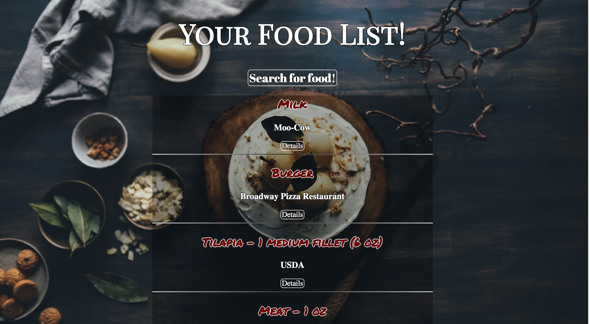

#Nutrition App





## What is the 'Nutrition App'?

The 'News Bubble' is an app in which users can register and create a unqiue selection of favorite news sources.

When a user registers and logs in, they can check their history as well as search for current food
that they plan on eating and get the nutritional content. The plan was to implement the ability to 
add a calendar function which would allow tracking totals per day but its still in the works and not functional yet. 

The user has the ability to add or delete more food.

Heroku Link: https://desolate-wave-52600.herokuapp.com/

##Technical Discussion

The app utilizes the following technologies:

HTML/EJS 
CSS
JavaScript
JQuery
SQL 
Express.js 
API Call 


##Sample Code

Sample code: Displays the nutritional info as a table to make it look like
the nutritional info label

```
<h1> Nutritional Info</h1>
<% for (let nutri of data) { %>
<table id="t">
  <thead>
    <tr>
      <th>Food</th>
      <th>Brand</th>
      <th>Calories</th>
      <th>Fiber</th>
      <th>Carbohydrates</th>
      <th>Fat</th>
    </tr>
  </thead>
  <tbody>
    <tr>
      <td><%= data[0].food %></td>
      <td><%= data[0].brand %></td>
      <td><%= data[0].calories %></td>
      <td><%= data[0].fiber %></td>
      <td><%= data[0].carbs %></td>
      <td><%= data[0].fat %></td>
    </tr>
  </tbody>
  <tfoot>
</table>
```

##Acknowledgements

Thanks to the following for their assistance: Asher Shereen, Aury Rodriguez, Joe Tricot, Oswaldo Almazo, Carly Warner, SRC (gracehopper)

##Opportunities for Future Growth
I plan on adding a calandar function that allows you to seperate what you have eaten by date and see the totals. 
